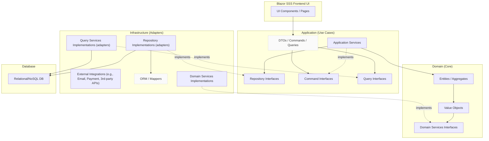

# Blazor frontend til Domain Centric Backend

## Formål

Formålet med denne demo er at vise hvorledes elemeterne i arkitekturen "spiller sammen". 

Formålet er IKKE at vise korrekt implementering af de enkelte lag. Eksempelvis implementeres domain entities som en "Anemic domain model" Ligeledes er alle ikke strengt nødvendige implementeringer af interfaces "tomme" (de kaster blot en exception) 

Fokus er:

- Blazor kobles sammen med en "Onion Core"
- Opsætning af IoC containeren via Blazor
- Opsætning af Entity Framework via Blazor
- Database migration og database update.
- Systemtest - der er "hul" fra Blazor til database

Hertil oprettes det nødvendige kodeskelet for at kunne opfylde formålet. 


## Forudsætninger


Der anvende .NET 10 og Visual Studio 2026 Insider til løsningen.

Tjek din .NET version inden du går igang:

```powershell
C:\Demo>dotnet --version
10.0.100-rc.2.25502.107
```

Du skal mindst være på version `10.0.100-rc.2`


## Overblik over arkitekturen

Nedenstående er vist et oversigtsdiagram for demo projektet




## Oprettelse af Visual Studio Solution samt projekter

Til oprettelse af Visual Studio projektet kan man med fordel anvende `KbrOnionTemplate-Core-latest.bat` (som er vist i Bilag 1).

I nedenstående eksempel vises oprettelsen af en solution med projekter for `BlazorOnionDemo` - de er de første tre linjer er input - resten er output fra scriptet (der vises kun et udsnit af output):

```powershell
C:\Demo>KbrOnionTemplate-Core-latest.bat
Enter application name: BlazorOnionDemo
Are You Sure? [Y,N]?Y
Creating BlazorOnionDemo
The template "Blazor Web App" was created successfully.
This template contains technologies from parties other than Microsoft, see https://aka.ms/aspnetcore/10.0-third-party-notices for details.

Processing post-creation actions...
Restoring C:\Demo\BlazorOnionDemo\BlazorOnionDemo.WebUi\BlazorOnionDemo.WebUi.csproj:
Restore succeeded.


The template "Class Library" was created successfully.

Processing post-creation actions...
Restoring C:\Demo\BlazorOnionDemo\BlazorOnionDemo.Application\BlazorOnionDemo.Application.csproj:
Restore succeeded.


The template "Class Library" was created successfully.

Processing post-creation actions...
Restoring C:\Demo\BlazorOnionDemo\BlazorOnionDemo.Domain\BlazorOnionDemo.Domain.csproj:
Restore succeeded.


The template "NUnit Test Project" was created successfully.

Processing post-creation actions...
Restoring C:\Demo\BlazorOnionDemo\BlazorOnionDemo.Domain.Test\BlazorOnionDemo.Domain.Test.csproj:
Restore succeeded.


The template "Class Library" was created successfully.

Processing post-creation actions...
Restoring C:\Demo\BlazorOnionDemo\BlazorOnionDemo.Infrastructure\BlazorOnionDemo.Infrastructure.csproj:
Restore succeeded.


Reference `..\BlazorOnionDemo.Application\BlazorOnionDemo.Application.csproj` added to the project.
Reference `..\BlazorOnionDemo.Domain\BlazorOnionDemo.Domain.csproj` added to the project.
Reference `..\BlazorOnionDemo.Infrastructure\BlazorOnionDemo.Infrastructure.csproj` added to the project.
Reference `..\BlazorOnionDemo.Domain\BlazorOnionDemo.Domain.csproj` added to the project.
Reference `..\BlazorOnionDemo.Domain\BlazorOnionDemo.Domain.csproj` added to the project.
Reference `..\BlazorOnionDemo.Domain\BlazorOnionDemo.Domain.csproj` added to the project.
Reference `..\BlazorOnionDemo.Application\BlazorOnionDemo.Application.csproj` added to the project.
The template "Solution File" was created successfully.

Project `BlazorOnionDemo.WebUi\BlazorOnionDemo.WebUi.csproj` added to the solution.
Project `BlazorOnionDemo.Application\BlazorOnionDemo.Application.csproj` added to the solution.
Project `BlazorOnionDemo.Domain\BlazorOnionDemo.Domain.csproj` added to the solution.
Project `BlazorOnionDemo.Infrastructure\BlazorOnionDemo.Infrastructure.csproj` added to the solution.

Update nuget packages
Tool 'dotnet-outdated-tool' is already installed.
Discovering projects...
Analyzing project(s)...
Analyzing dependencies...
» BlazorOnionDemo.Domain.Test
  [net10.0]
  Microsoft.NET.Test.Sdk  17.14.0 -> 18.0.0
  NUnit                   4.3.2   -> 4.4.0
  NUnit.Analyzers         4.7.0   -> 4.10.0
  NUnit3TestAdapter       5.0.0   -> 5.2.0

Version color legend:
<red>   : Major version update or pre-release version. Possible breaking changes.
<yellow>: Minor version update. Backwards-compatible features added.
<green> : Patch version update. Backwards-compatible bug fixes.

Upgrading package Microsoft.NET.Test.Sdk...
Project BlazorOnionDemo.Domain.Test [net10.0] upgraded successfully

Upgrading package NUnit...
Project BlazorOnionDemo.Domain.Test [net10.0] upgraded successfully

Upgrading package NUnit.Analyzers...
Project BlazorOnionDemo.Domain.Test [net10.0] upgraded successfully

Upgrading package NUnit3TestAdapter...
Project BlazorOnionDemo.Domain.Test [net10.0] upgraded successfully

Elapsed: 00:00:07.3917757
C:\Demo\BlazorOnionDemo>
```


------------------------

## Oprettelse af demo kode

### Domain model

```c#
namespace BlazorOnionDemo.Domain.Entity;

public class Author
{
    public int Id { get; set; }
    public string Name { get; set; }
    public List<Book> Books { get; set; }
}

public class Book
{
    public int Id { get; set; }
    public string Title { get; set; }
    public string Description { get; set; }
    public Author Author { get; set; }
}
```


### Application layer

#### Kontrakter

`IAuthorCommand`

```c#
namespace BlazorOnionDemo.Application.Contracts.Commands;

public interface IAuthorCommand
{
    Task CreateAsync(AuthorCreateCommandDto dto);
    Task AddBookToAuthorAsync(AddBookToAuthorCommandDto dto);
}

public class AddBookToAuthorCommandDto
{
    public int AuthorId { get; set; }
    public BookCreateCommandDto Book { get; set; }
}

public class AuthorCreateCommandDto
{
    public string Name { get; set; }
}

public class BookCreateCommandDto
{
    public string Title { get; set; }
    public string Description { get; set; }
}
```


`IBookCommand`

```c#
namespace BlazorOnionDemo.Application.Contracts.Commands;

public interface IBookCommand
{
    Task CreateAsync(BookCreateCommandDto dto);
}
```


`IAuthorQuery`

```c#
namespace BlazorOnionDemo.Application.Contracts.Queries;

public interface IAuthorQuery
{
    Task<AuthorDto> GetByIdAsync(int id);
    Task<List<AuthorDto>> GetAllAsync();
}

public class AuthorDto
{
    public int Id { get; set; }
    public string Name { get; set; }
    public List<AuthorBookDto> Books { get; set; }
}

public class AuthorBookDto
{
    public int Id { get; set; }
    public string Title { get; set; }
    public string Description { get; set; }
}
```


`IBookQuery`

```c#
namespace BlazorOnionDemo.Application.Contracts.Queries;

public interface IBookQuery
{
    Task<BookDto> GetByIdAsync(int id);
    Task<List<BookDto>> GetAllAsync();
}

public class BookDto
{
    public int Id { get; set; }
    public string Title { get; set; }
    public string Description { get; set; }
    public BookAuthorDto Author { get; set; }
}

public class BookAuthorDto
{
    public int Id { get; set; }
    public string Name { get; set; }    
}
```


`IAuthorRepository`

```c#
using BlazorOnionDemo.Domain.Entity;

namespace BlazorOnionDemo.Application.Repositories;

public interface IAuthorRepository
{
    Task<Author> LoadAsync(int id);
    Task<int> SaveAsync();
    Task AddAsync(Author author);
}
```


`IBookRepository`

```c#
using BlazorOnionDemo.Domain.Entity;

namespace BlazorOnionDemo.Application.Repositories;

public interface IBookRepository
{
    Task<Book> LoadAsync(int id);
    Task<int> SaveAsync();
    Task AddAsync(Book author);
}
```


#### CommandHandlers

`AuthorCommand`

```c#
using BlazorOnionDemo.Application.Contracts.Commands;
using BlazorOnionDemo.Application.Repositories;
using BlazorOnionDemo.Domain.Entity;

namespace BlazorOnionDemo.Application.CommandHandlers;

public class AuthorCommand : IAuthorCommand
{
    private readonly IAuthorRepository _repository;

    public AuthorCommand(IAuthorRepository repository)
    {
        _repository = repository;
    }
    async Task IAuthorCommand.AddBookToAuthorAsync(AddBookToAuthorCommandDto dto)
    {
        var author = await _repository.LoadAsync(dto.AuthorId);
        if (author == null)
        {
            throw new Exception("Author not found");
        }

        var book = new Book
        {
            Title = dto.Book.Title,
            Description = dto.Book.Description
        };
        author.Books.Add(book);
        await _repository.SaveAsync();

    }

    async Task IAuthorCommand.CreateAsync(AuthorCreateCommandDto dto)
    {
        var author = new Author { Name = dto.Name };
        await _repository.AddAsync(author);
    }
}
```


`BookCommand`

```c#
using BlazorOnionDemo.Application.Contracts.Commands;

namespace BlazorOnionDemo.Application.CommandHandlers;

public class BookCommand : IBookCommand
{
    async Task IBookCommand.CreateAsync(BookCreateCommandDto dto)
    {
        throw new NotImplementedException();
    }
}
```


### Infrastructure layer

#### Repositories

`AuthorRepository`

```c#
using BlazorOnionDemo.Application.Repositories;
using BlazorOnionDemo.Domain.Entity;
using BlazorOnionDemo.Infrastructure.Database;
using Microsoft.EntityFrameworkCore;

namespace BlazorOnionDemo.Infrastructure.Repositories;

public class AuthorRepository : IAuthorRepository
{
    private readonly OrmContext _db;

    public AuthorRepository(OrmContext db)
    {
        _db = db;
    }
    async Task IAuthorRepository.AddAsync(Author author)
    {
        _db.Authors.Add(author);
        await _db.SaveChangesAsync();
    }

    async Task<Author> IAuthorRepository.LoadAsync(int id)
    {
        return await _db.Authors.Include(a => a.Books).FirstAsync(a => a.Id == id);
    }

    async Task<int> IAuthorRepository.SaveAsync()
    {
        return await _db.SaveChangesAsync();
    }
}
```


`BookRepository`

```c#
using BlazorOnionDemo.Application.Repositories;
using BlazorOnionDemo.Domain.Entity;

namespace BlazorOnionDemo.Infrastructure.Repositories;

public class BookRepository : IBookRepository
{
    async Task IBookRepository.AddAsync(Book author)
    {
        throw new NotImplementedException();
    }

    async Task<Book> IBookRepository.LoadAsync(int id)
    {
        throw new NotImplementedException();
    }

    async Task<int> IBookRepository.SaveAsync()
    {
        throw new NotImplementedException();
    }
}
```


#### Queries

`AuthorQuery`

```c#
using BlazorOnionDemo.Application.Contracts.Queries;
using BlazorOnionDemo.Infrastructure.Database;
using Microsoft.EntityFrameworkCore;

namespace BlazorOnionDemo.Infrastructure.Queries;

public class AuthorQuery : IAuthorQuery
{
    private readonly OrmContext _db;

    public AuthorQuery(OrmContext db)
    {
        _db = db;
    }

    async Task<List<AuthorDto>> IAuthorQuery.GetAllAsync()
    {
        return await _db.Authors
            .AsNoTracking()
            .Select(a => new AuthorDto
            {
                Id = a.Id,
                Name = a.Name,
                Books = a.Books
                    .Select(b => new AuthorBookDto
                    {
                        Id = b.Id,
                        Title = b.Title,
                        Description = b.Description
                    })
                    .ToList()
            })
            .ToListAsync();
    }


    async Task<AuthorDto> IAuthorQuery.GetByIdAsync(int id)
    {
        return await _db.Authors
            .AsNoTracking()
            .Where(a => a.Id == id)
            .Select(a => new AuthorDto
            {
                Id = a.Id,
                Name = a.Name,
                Books = a.Books
                    .Select(b => new AuthorBookDto
                    {
                        Id = b.Id,
                        Title = b.Title,
                        Description = b.Description
                    })
                    .ToList()
            })
            .SingleAsync();
    }
}
```


`BookQuery`

```c#
using BlazorOnionDemo.Application.Contracts.Queries;

namespace BlazorOnionDemo.Infrastructure.Queries;

public class BookQuery : IBookQuery
{
    async Task<List<BookDto>> IBookQuery.GetAllAsync()
    {
        throw new NotImplementedException();
    }

    async Task<BookDto> IBookQuery.GetByIdAsync(int id)
    {
        throw new NotImplementedException();
    }
}
```


#### Database

`OrmContext`

```c#
using BlazorOnionDemo.Domain.Entity;
using Microsoft.EntityFrameworkCore;

namespace BlazorOnionDemo.Infrastructure.Database;

public class OrmContext : DbContext
{
    public DbSet<Author> Authors { get; set; }
    public DbSet<Book> Books { get; set; }

    public OrmContext(DbContextOptions<OrmContext> options) : base(options)
    {
    }
}
```


------------------

# Integration af lag

Vi er nu klare til at implementere:

- Opsætning af IoC containeren via Blazor
- Opsætning af Entity Framework via Blazor
- Blazor kobles sammen med en "Onion Core"


## Opsætning af IoC containeren via Blazor

For at holde IoC opsætningen fokuseret tilføjes en hjælpeklasse i hver lag

### Application layer

`ApplicationServiceRegistration`

```c#
using BlazorOnionDemo.Application.CommandHandlers;
using BlazorOnionDemo.Application.Contracts.Commands;
using Microsoft.Extensions.DependencyInjection;

namespace BlazorOnionDemo.Application;

public static class ApplicationServiceRegistration
{
    public static IServiceCollection AddApplicationServices(this IServiceCollection services)
    {
        services.AddScoped<IAuthorCommand, AuthorCommand>();
        services.AddScoped<IBookCommand, BookCommand>();

        return services;
    }
}
```


### Infrastructure layer

`InfrastructureServiceRegistration`

```c#
using BlazorOnionDemo.Application.Contracts.Queries;
using BlazorOnionDemo.Application.Repositories;
using BlazorOnionDemo.Infrastructure.Database;
using BlazorOnionDemo.Infrastructure.Queries;
using BlazorOnionDemo.Infrastructure.Repositories;
using Microsoft.EntityFrameworkCore;
using Microsoft.Extensions.Configuration;
using Microsoft.Extensions.DependencyInjection;

namespace BlazorOnionDemo.Infrastructure;

public static class InfrastructureServiceRegistration
{
    public static IServiceCollection AddInfrastructureServices(this IServiceCollection services,
        IConfiguration configuration)
    {
        // Register Query implementations
        services.AddScoped<IAuthorQuery, AuthorQuery>();
        services.AddScoped<IBookQuery, BookQuery>();

        // Register Repository implementations
        services.AddScoped<IAuthorRepository, AuthorRepository>();
        services.AddScoped<IBookRepository, BookRepository>();

        // Database
        // https://github.com/dotnet/SqlClient/issues/2239
        // https://learn.microsoft.com/en-us/ef/core/managing-schemas/migrations/projects?tabs=dotnet-core-cli
        // Add-Migration InitialMigration -Context OrmContext -Project BlazorOnionDemo.Infrastructure
        // Update-Database -Context OrmContext -Project BlazorOnionDemo.Infrastructure
        services.AddDbContext<OrmContext>(options =>
        {
            options.UseSqlServer(configuration.GetConnectionString("DbConnection"));
        });

        return services;
    }
}
```


Da IoC rodpunktet placeres i Blazor projektet, skal Blazor projektet kende alle de øvrige projekter.

Bemærk at `BlazorOnionDemo.WebUi.csproj` indeholder `ProjectReference` til de øvrige projekter (bortset fra testprojektet).

```xml
<Project Sdk="Microsoft.NET.Sdk.Web">

  <ItemGroup>
    <ProjectReference Include="..\BlazorOnionDemo.Application\BlazorOnionDemo.Application.csproj" />
    <ProjectReference Include="..\BlazorOnionDemo.Domain\BlazorOnionDemo.Domain.csproj" />
    <ProjectReference Include="..\BlazorOnionDemo.Infrastructure\BlazorOnionDemo.Infrastructure.csproj" />
  </ItemGroup>

  <ItemGroup>
	  <PackageReference Include="Microsoft.AspNetCore.Components.QuickGrid.EntityFrameworkAdapter" Version="9.0.10" />
	  <PackageReference Include="Microsoft.EntityFrameworkCore" Version="9.0.10" />
    <PackageReference Include="Microsoft.EntityFrameworkCore.SqlServer" Version="9.0.10" />
    <PackageReference Include="Microsoft.EntityFrameworkCore.Tools" Version="9.0.10">
      <IncludeAssets>runtime; build; native; contentfiles; analyzers; buildtransitive</IncludeAssets>
      <PrivateAssets>all</PrivateAssets>
    </PackageReference>
  </ItemGroup>

  <PropertyGroup>
    <TargetFramework>net10.0</TargetFramework>
    <Nullable>enable</Nullable>
    <ImplicitUsings>enable</ImplicitUsings>
    <BlazorDisableThrowNavigationException>true</BlazorDisableThrowNavigationException>
  </PropertyGroup>

</Project>


```


Derfor kan vi nu indsætte en IoC blok i `Program.cs`

```c#
using BlazorOnionDemo.Application;
using BlazorOnionDemo.Infrastructure;
using BlazorOnionDemo.WebUi.Components;

var builder = WebApplication.CreateBuilder(args);

// Add services to the container.
builder.Services.AddRazorComponents()
    .AddInteractiveServerComponents();

// Blazor frontend til Domain Centric Backend - IoC setup
builder.Services.AddApplicationServices(); // from BlazorOnionDemo.Application
builder.Services.AddInfrastructureServices(builder.Configuration); // from BlazorOnionDemo.Infrastructure


var app = builder.Build();

// Configure the HTTP request pipeline.
if (!app.Environment.IsDevelopment())
{
    app.UseExceptionHandler("/Error", true);
    // The default HSTS value is 30 days. You may want to change this for production scenarios, see https://aka.ms/aspnetcore-hsts.
    app.UseHsts();
}

app.UseStatusCodePagesWithReExecute("/not-found", createScopeForStatusCodePages: true);
app.UseHttpsRedirection();

app.UseAntiforgery();

app.MapStaticAssets();
app.MapRazorComponents<App>()
    .AddInteractiveServerRenderMode();

app.Run();

```


## Opsætning af Entity Framework via Blazor

### Connectionstring

I `appsettings.json` tilføjes "`ConnectionStrings`":

```json
{
  "ConnectionStrings": {
    "DbConnection": "Server=localhost;Database=BlazorOnionDemoDb;Trusted_Connection=True;MultipleActiveResultSets=true;TrustServerCertificate=true "
  },

  "Logging": {
    "LogLevel": {
      "Default": "Information",
      "Microsoft.AspNetCore": "Warning"
    }
  },
  "AllowedHosts": "*"
}
```

Hvis din SQL server IKKE er installeret lokalt (localhost), skal du tilrette "`localhost`"  i `appsettings.json`

### Database migration & Database update

Åben et "`Packet Manager Console`" vindue og kør kommandoen

```powershell
Add-Migration InitialMigration -Context OrmContext -Project BlazorOnionDemo.Infrastructure
```

Tjek at der oprettes `Migrations` i `BlazorOnionDemo.Infrastructure`

Dernæst - kør kommandoen

```powershell
Update-Database -Context OrmContext -Project BlazorOnionDemo.Infrastructure
```


## Blazor kobles sammen med en "Onion Core"

Vi er nu klar til at lave Blazor pages der anvender vores "Core" som forretningslogik.

Inspiration til koden er hentet [her](https://github.com/dotnet/blazor-samples/tree/main/9.0/BlazorWebAppMovies)

Under `Pages` oprettes folderen `AuthorPages`

### Index Page

`Index.razor`

```c#
@page "/authors"
@using BlazorOnionDemo.Application.Contracts.Queries
@using Microsoft.AspNetCore.Components.QuickGrid

@inject IAuthorQuery AuthorQuery

<PageTitle>Index</PageTitle>

<h1>Index</h1>

<p>
    <a href="authors/create">Create New</a>
</p>

<div>
    <QuickGrid Class="table" Items="Authors" Pagination="pagination">
        <PropertyColumn Property="author => author.Id" Sortable="true"/>
        <PropertyColumn Property="author => author.Name" Sortable="true"/>
        <PropertyColumn Property="author => author.Books.Count" Title="Book count"/>

        <TemplateColumn Context="author">
            <a href="@($"authors/details?id={author.Id}")">Details</a>
        </TemplateColumn>
    </QuickGrid>
</div>

<Paginator State="pagination"/>

@code {

    private readonly PaginationState pagination = new() { ItemsPerPage = 5 };
    private IQueryable<AuthorDto> Authors; // = default!; /* => context.Movie.Where(m => m.Title!.Contains(titleFilter)); */

    protected override async Task OnInitializedAsync()
    {
        Authors = (await AuthorQuery.GetAllAsync()).AsQueryable();
    }

}
```


`Index.razor.css`

```css
::deep tr {
    height: 3em;
}

    ::deep tr > td {
        vertical-align: middle;
    }

```


### Create Page

`Create.razor`

```c#
@page "/authors/create"
@using BlazorOnionDemo.Application.Contracts.Commands
@inject IAuthorCommand Command
@inject NavigationManager NavigationManager

<PageTitle>Create</PageTitle>

<h1>Create</h1>

<h2>Author</h2>
<hr/>
<div class="row">
    <div class="col-md-4">
        <EditForm method="post" Model="Author" OnValidSubmit="AddAuthor" FormName="create" Enhance>
            <DataAnnotationsValidator/>
            <ValidationSummary class="text-danger" role="alert"/>
            <div class="mb-3">
                <label for="title" class="form-label">Name:</label>
                <InputText id="title" @bind-Value="Author.Name" class="form-control"/>
                <ValidationMessage For="() => Author.Name" class="text-danger"/>
            </div>
            <button type="submit" class="btn btn-primary">Create</button>
        </EditForm>
    </div>
</div>

<div>
    <a href="/authors">Back to List</a>
</div>

@code {
    [SupplyParameterFromForm] private AuthorCreateCommandDto Author { get; set; } = new();

    private async Task AddAuthor()
    {
        await Command.CreateAsync(Author);
        NavigationManager.NavigateTo("/authors");
    }

}
```


### Details Page

`Details.razor`

```c#
@page "/authors/details"
@using BlazorOnionDemo.Application.Contracts.Queries
@using Microsoft.AspNetCore.Components.QuickGrid

@inject IAuthorQuery AuthorQuery
@inject NavigationManager NavigationManager

<PageTitle>Details</PageTitle>

<h1>Details</h1>

<div>
    <h2>Author</h2>
    <hr/>
    @if (author is null)
    {
        <p>
            <em>Loading...</em>
        </p>
    }
    else
    {
        <dl class="row">
            <dt class="col-sm-2">Id</dt>
            <dd class="col-sm-10">@author.Id</dd>
            <dt class="col-sm-2">Name</dt>
            <dd class="col-sm-10">@author.Name</dd>
        </dl>
        <div>
            <a href="@($"/authors/addBook?id={author.Id}")">Add book</a> |
            <a href="@("/authors")">Back to List</a>
        </div>
    }

    <h3>Books</h3>

    <div>
        <QuickGrid Class="table" Items="Books" Pagination="pagination">
            <PropertyColumn Property="book => book.Id" Sortable="true"/>
            <PropertyColumn Property="book => book.Title" Sortable="true"/>
            <PropertyColumn Property="book => book.Description" Title="Book count"/>
        </QuickGrid>
    </div>
</div>

<Paginator State="pagination"/>

@code {
    private AuthorDto? author;
    private readonly PaginationState pagination = new() { ItemsPerPage = 5 };
    private IQueryable<AuthorBookDto> Books => author?.Books.AsQueryable() ?? Enumerable.Empty<AuthorBookDto>().AsQueryable();

    [SupplyParameterFromQuery] private int Id { get; set; }

    protected override async Task OnInitializedAsync()
    {
        author = await AuthorQuery.GetByIdAsync(Id);

        if (author is null)
        {
            NavigationManager.NavigateTo("notfound");
        }
    }

}
```


`Details.razor.css`

```css
::deep tr {
    height: 3em;
}

    ::deep tr > td {
        vertical-align: middle;
    }

```


### Page AddBook

`AddBook.razor`

```c#
@page "/authors/addBook"
@using BlazorOnionDemo.Application.Contracts.Commands
@inject IAuthorCommand Command
@inject NavigationManager NavigationManager

<PageTitle>Add book</PageTitle>

<h1>Add book</h1>

<h2>Book</h2>
<hr/>

<div class="row">
    <div class="col-md-4">
        <EditForm method="post" Model="Book" OnValidSubmit="Add" FormName="create" Enhance>
            <DataAnnotationsValidator/>
            <ValidationSummary class="text-danger" role="alert"/>
            <div class="mb-3">
                <label for="title" class="form-label">Title:</label>
                <InputText id="title" @bind-Value="Book.Title" class="form-control"/>
                <ValidationMessage For="() => Book.Title" class="text-danger"/>
            </div>
            <div class="mb-3">
                <label for="title" class="form-label">Description:</label>
                <InputText id="title" @bind-Value="Book.Description" class="form-control"/>
                <ValidationMessage For="() => Book.Description" class="text-danger"/>
            </div>
            <button type="submit" class="btn btn-primary">Create</button>
        </EditForm>
    </div>
</div>

<div>
    <a href="@($"authors/details?id={Id}")">Back to List</a>
</div>

@code {
    [SupplyParameterFromForm] private BookCreateCommandDto Book { get; set; } = new();

    [SupplyParameterFromQuery] private int Id { get; set; }

    private async Task Add()
    {
        var command = new AddBookToAuthorCommandDto { AuthorId = Id, Book = Book };
        await Command.AddBookToAuthorAsync(command);
        NavigationManager.NavigateTo($"authors/details?id={Id}");
    }

}
```


### Layout NavMenu.razor

I folderen `Layout` tilrettes `NavMenu.razor`

```
<div class="top-row ps-3 navbar navbar-dark">
    <div class="container-fluid">
        <a class="navbar-brand" href="">BlazorOnionDemo.WebUi</a>
    </div>
</div>

<input type="checkbox" title="Navigation menu" class="navbar-toggler" />

<div class="nav-scrollable" onclick="document.querySelector('.navbar-toggler').click()">
    <nav class="nav flex-column">
        <div class="nav-item px-3">
            <NavLink class="nav-link" href="" Match="NavLinkMatch.All">
                <span class="bi bi-house-door-fill-nav-menu" aria-hidden="true"></span> Home
            </NavLink>
        </div>

        <div class="nav-item px-3">
            <NavLink class="nav-link" href="counter">
                <span class="bi bi-plus-square-fill-nav-menu" aria-hidden="true"></span> Counter
            </NavLink>
        </div>

        <div class="nav-item px-3">
            <NavLink class="nav-link" href="weather">
                <span class="bi bi-list-nested-nav-menu" aria-hidden="true"></span> Weather
            </NavLink>
        </div>
        
        <div class="nav-item px-3">
            <NavLink class="nav-link" href="authors">
                <span class="bi bi-list-nested-nav-menu" aria-hidden="true"></span> Authors
            </NavLink>
        </div>

    </nav>
</div>


```


---------------------------

# Systemtest - der er "hul" fra Blazor til database

### I `SQL Server Management Studio` 

Start med at kontrollerer at der er oprettet en database. Dette gøres ved at anvende `SQL Server Management Studio` til at undersøge om der er oprettet en database. Hvis migration og oprettelse af database er gået godt, skal databasen `BlazorOnionDemoDb` være synlig i `SQL Server Management Studio`.


### I `Visual Studio`

I `Visual Studio` skal `BlazorOnionDemo.WebUi` være "Startup Projekt". Herefter startes applikationen og der åbnes en Brower med "Hello World" siden.

Naviger til  Authors og vælg "Create New". 

Opret en Author ved at udfylde "Name" og vælge "Create".

Applikationen vender nu tilbage til Index siden, og den nye "Author" vises i listen.

Vælg Details

Vælg "Add book"

Udfyld "Title" og "Description" og vælg "Create"

Applikationen vender nu tilbage til Details siden, og den nye "Book" vises i listen.

Vend tilbage til Index siden

Bemærk at Book Count nu er "1".


### I `SQL Server Management Studio` 

Tjek at der er data i tabellerne `Authors` og `Books`


------------------------------

# Bilag


## Bilag 1 - Script til projektoprettelse

`KbrOnionTemplate-Core-latest.bat`

```bat
@echo off
set /p "app=Enter application name: "
rem echo Are You Sure?
choice /c YN /M "Are You Sure?"
if %errorlevel%==1 goto yes
if %errorlevel%==2 goto no
:yes
echo Creating %app%

if not exist %app% mkdir %app%
cd %app%

rem dotnet new mvc -au Individual -uld -o %app%.Mvc
dotnet new blazor -au None -o %app%.WebUi
dotnet new classlib -o %app%.Application
dotnet new classlib -o %app%.Domain
dotnet new nunit -o %app%.Domain.Test
dotnet new classlib -o %app%.Infrastructure

dotnet add %app%.WebUi reference %app%.Application
dotnet add %app%.WebUi reference %app%.Domain
dotnet add %app%.WebUi reference %app%.Infrastructure
dotnet add %app%.Domain.Test reference %app%.Domain
dotnet add %app%.Application reference %app%.Domain
dotnet add %app%.Infrastructure reference %app%.Domain
dotnet add %app%.Infrastructure reference %app%.Application

dotnet new sln -n %app%
dotnet sln %app%.sln add %app%.WebUi/%app%.WebUi.csproj
dotnet sln %app%.sln add %app%.Application/%app%.Application.csproj
dotnet sln %app%.sln add %app%.Domain/%app%.Domain.csproj
dotnet sln %app%.sln add %app%.Domain.Test/%app%.Domain.Test.csproj
dotnet sln %app%.sln add %app%.Infrastructure/%app%.Infrastructure.csproj

dotnet add %app%.WebUi/%app%.WebUi.csproj package Microsoft.EntityFrameworkCore
dotnet add %app%.WebUi/%app%.WebUi.csproj package Microsoft.EntityFrameworkCore.SqlServer
dotnet add %app%.WebUi/%app%.WebUi.csproj package Microsoft.EntityFrameworkCore.Tools
dotnet add %app%.WebUi/%app%.WebUi.csproj package Microsoft.EntityFrameworkCore.Design
dotnet add %app%.WebUi/%app%.WebUi.csproj package Microsoft.VisualStudio.Web.CodeGeneration.Design
dotnet add %app%.WebUi/%app%.WebUi.csproj package Microsoft.AspNetCore.Components.QuickGrid.EntityFrameworkAdapter

dotnet add %app%.Application/%app%.Application.csproj package Microsoft.Extensions.DependencyInjection
dotnet add %app%.Application/%app%.Application.csproj package Microsoft.Extensions.Configuration.Abstractions

dotnet add %app%.Infrastructure/%app%.Infrastructure.csproj package Microsoft.EntityFrameworkCore
dotnet add %app%.Infrastructure/%app%.Infrastructure.csproj package Microsoft.EntityFrameworkCore.SqlServer
dotnet add %app%.Infrastructure/%app%.Infrastructure.csproj package Microsoft.EntityFrameworkCore.Tools
dotnet add %app%.Infrastructure/%app%.Infrastructure.csproj package Microsoft.Extensions.DependencyInjection
dotnet add %app%.Infrastructure/%app%.Infrastructure.csproj package Microsoft.Extensions.Configuration.Abstractions


dotnet add %app%.Domain.Test/%app%.Domain.Test.csproj package Moq
@echo off
echo Update nuget packages
rem "https://www.reddit.com/r/dotnet/comments/1757s1o/upgrading_multiple_nuget_packages_in_jetbrains/?rdt=62769"
dotnet tool install --global dotnet-outdated-tool 
dotnet outdated --upgrade
:no
```

